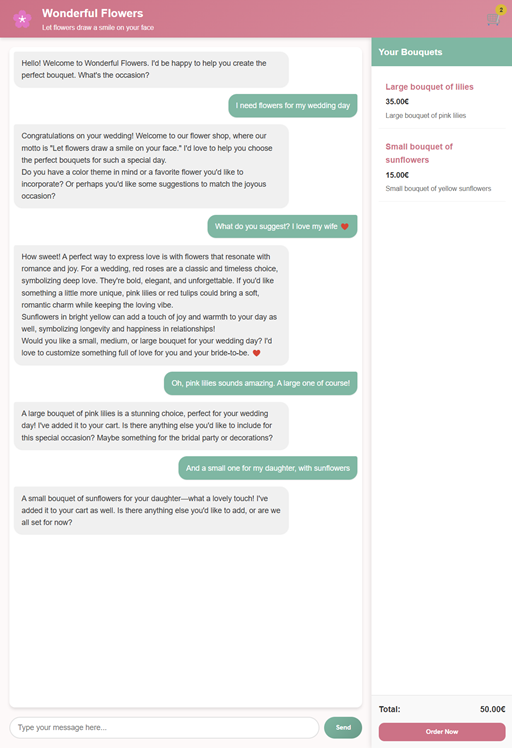

# Azure Intro - E-Commerce Flower Shop with AI

## Project Overview

This demo project showcases a modern e-commerce application for a flower shop built using Azure services. The application integrates a web frontend with a backend API and leverages Azure OpenAI for chat-based shopping assistance.

## Project Structure

The repository consists of two main projects:

### WebFrontend

A single-page application built with TypeScript that provides the user interface for the flower shop. It allows users to:
- Browse and add flower bouquets to their shopping cart
- Chat with an AI assistant about their flower choices
- Manage their cart items

The frontend is deployed to Azure Static Web Apps and communicates with the backend API to process user interactions.

### WebApi

A Node.js API service built with Express and TypeScript that handles:
- Cart management through Azure SQL Database
- AI chat processing using Azure OpenAI
- Secure secret management with Azure Key Vault
- Application monitoring with Azure Application Insights (through OpenTelemetry)

The API service provides endpoints for cart operations and AI chat functionality, and is deployed to Azure App Service.

## Azure Services Used

This project demonstrates the use of several Azure services:

### Compute & Hosting
- **Azure App Service**: Hosts the WebApi backend service
- **Azure Static Web Apps**: Hosts the WebFrontend single-page application
- **Azure Container Registry**: Stores Docker containers for deployment

### Data & Storage
- **Azure SQL Database**: Stores cart and product information

### AI & Machine Learning
- **Azure OpenAI Service**: Powers the AI shopping assistant with GPT-4o

### Security & Identity
- **Azure Key Vault**: Securely stores application secrets
- **Azure Managed Identity**: Provides authentication for services to access Key Vault and SQL Database without storing credentials in code
- **Azure Entra ID**: Handles authentication and authorization

### Monitoring
- **Application Insights**: Provides telemetry and monitoring for the application
- **OpenTelemetry**: Integrated for detailed tracing of API operations

## Getting Started

To run this project locally, you'll need to:
1. Clone the repository
2. Set up the required Azure resources
3. Configure environment variables
4. Start the frontend and backend services

Refer to the scripts in `WebApi/scripts.azcli` for Azure resource setup commands.
